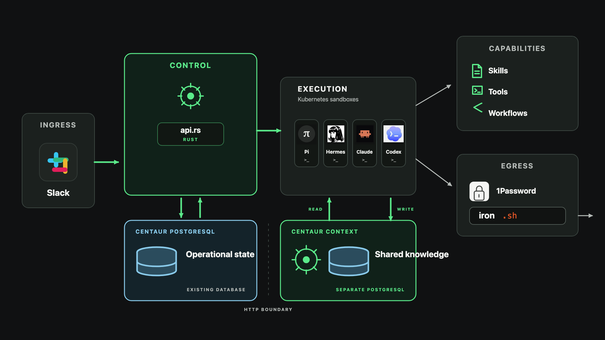
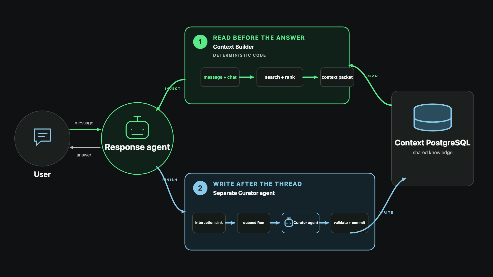
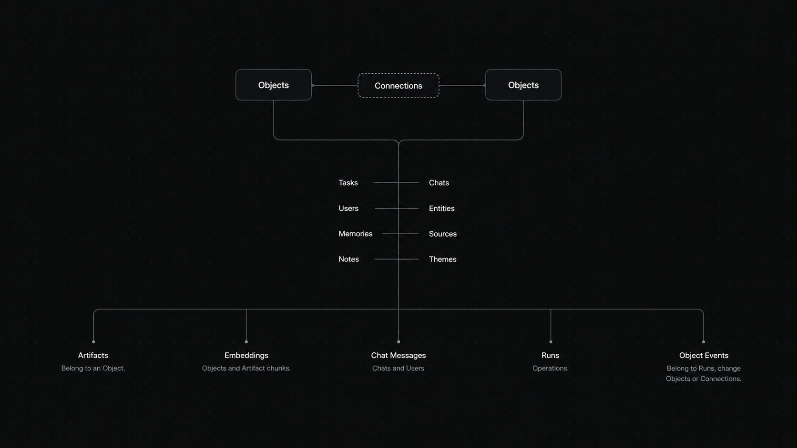

# Centaur Context

> [!IMPORTANT]
> **Centaur Context is an app/extension for [Centaur](https://github.com/paradigmxyz/centaur).** Centaur is an open-source control plane for running and owning your own agent infrastructure. We've created a [Centaur walkthrough video](https://youtu.be/993XrWfg34U).
>
> Install Centaur and become comfortable operating it before adding Centaur Context. If you haven't installed Centaur yet, start with [Centaur's official quickstart](https://centaur.run/quickstart). Then return here and follow the [Centaur Context setup instructions](https://github.com/bradwmorris/centaur-context/blob/main/docs/setup.md).

## How it works

[Centaur](https://github.com/paradigmxyz/centaur) runs your agents. Centaur-Context is the accumulating and compounding knowledge that grows alongside it. It runs beside Centaur as a separate Rust service, with its own PostgreSQL database.

It turns completed interactions into structured records, connects them to what is already known, and retrieves relevant context for future work. A web UI lets you inspect and manage that knowledge.

There are two main components:

- **context (read)** retrieves and builds a relevant context packet before the agent responds — title/description word search, kind/title/description semantic search and a lightweight traversal. Captured Artifact bodies are read explicitly after an Object is selected. This is just retrieval code, no LLM call.
- **curator (write)** — completed agent interactions are pushed to the knowledge base and queued as runs. A separate agent reviews and writes knowledge to the database, creating connections and refining memories, tasks, etc.

This creates a simple, compounding loop. Knowledge accumulates and becomes accessible to future interactions.

More specifically,

When a Slack message arrives,

1. Centaur identifies the matching Context Chat and sends Context the new question.
2. Context searches existing records for relevant information.
3. It includes closely connected records and packs the results into a short, bounded reference packet.
4. Centaur adds that packet to the agent’s input before the agent answers. If retrieval fails, the agent can still answer normally.

After the conversation is finished or inactive,

1. Context stores new Slack messages and queues a Curator Run for messages not already curated.
2. A worker loads those messages and potentially related existing records.
3. A model proposes a structured plan: create or update Objects and Connections, or make no changes.
4. Context checks that the plan is valid and supported by the messages, then records any approved changes with evidence. Not every conversation becomes a Memory.

Every normal interactive agent gets three Context tools when it needs more than
the automatically provided context:

- `context_search` finds Objects;
- `context_read` reads complete Objects and selected nearby information; and
- `context_apply` atomically creates, changes, archives, and connects ordinary
  Tasks, Entities, Sources, Notes, and Themes.

These tools are small Python clients in the Context repository. They send requests to Context’s Rust API; they do not search or change PostgreSQL themselves. Centaur’s credential proxy handles the real API tokens, so the agent sandbox does not receive them.

The shared rules live in
[`contract/context-contract.json`](contract/context-contract.json). Context
validates the same rules at its HTTP boundary; prompts and tool availability do
not grant database access.

## The schema and ontology

More information here:

[https://github.com/bradwmorris/centaur-context/blob/main/docs/schema.md](https://github.com/bradwmorris/centaur-context/blob/main/docs/schema.md)

I’ve tried a few ways to build agent memory: Neo4j and graph queries, and the opposite raw-dog wiki with simple search tools. Main lesson is that ‘the perfect architecture’ choice matters less than whether the system actually captures useful information, retrieves it at the right time, and lets you inspect the results. Most people focus far too much on the choice, and far too little on the evals.

Centaur Context takes a middle path. It uses PostgreSQL, but stores knowledge in a graph-shaped structure. Each first-class thing is an **Object** with a stable ID, a type, a title, and a clear description. The current types are Tasks, Chats, Users, Entities, Memories, Sources, Notes, and Themes.

**Connections** link Objects. Each Connection says what the relationship is and explains *why* it exists. For example, a Memory might be `derived_from` a Chat, or a Task might `depend_on` another Object. This lets agents search for something and then look at nearby, related knowledge without a separate graph database.

The types tell humans and agents what each Object represents and which extra fields it can have. Together, the types and relationships form the **ontology**: the system’s shared map of what it knows and how things fit together.

Tip: place special emphasis on ‘descriptions’. A title alone is often ambiguous; a concise description says what the Object is and why it matters in the current Context. Descriptions are current snapshots of at most 600 Unicode characters, not running logs; immutable Events and Runs retain the history. This gives text and semantic search enough context to find the right thing. If deeper graph traversal becomes necessary, a graph database may be worth revisiting. For this proof of concept, PostgreSQL gives us a simpler place to start.

## Connecting it to your Centaur

Centaur Context runs beside Centaur as a separate service. It is not a built-in Centaur App.

The current Slack proof of concept uses changes in [my Centaur fork](https://github.com/bradwmorris/centaur): two hooks for retrieving and storing context, plus separate changes for Chat identity and Curator inference. Stock Centaur does not include this integration.

If you want to try it, make the Centaur changes in your own fork. See the [setup guide](https://github.com/bradwmorris/centaur-context/blob/main/docs/setup.md) for the requirements and current limitations.

## Documentation

- [Schema and ontology](docs/schema.md) — Objects, Connections, evidence, and history.
- [Setup and operations](docs/setup.md) — install, connect, verify, and maintain
  Centaur Context beside an existing Centaur deployment.
- [Centaur integration contract](docs/centaur-integration.md) — the small
  connection between the proposed App and Centaur core.
- [UI modules](docs/ui-modules.md) — trusted compile-time views over canonical
  Context data.
- [Integration API](docs/api.md) — supported endpoints, credentials, headers,
  and minimal request examples.
- [Context contract](docs/context-contract.md) — the shared agent-facing rules
  and three universal tools.

Centaur Context runs alongside Centaur with its own PostgreSQL database. Centaur
owns agent execution; Context owns shared knowledge. Company-specific prompts,
workflows, and integrations belong in a private overlay.

Version 0.3.0 supports one organization on a local machine or trusted private
network. See [compatibility.toml](compatibility.toml) for the supported contract.

## Development

See [Contributing](CONTRIBUTING.md) for repository boundaries, development
checks, and contribution guidance. Agent-assisted contributors should also read
[AGENTS.md](AGENTS.md).

## License

[MIT](LICENSE). [Centaur](https://github.com/paradigmxyz/centaur) is separate
software with its own license.
