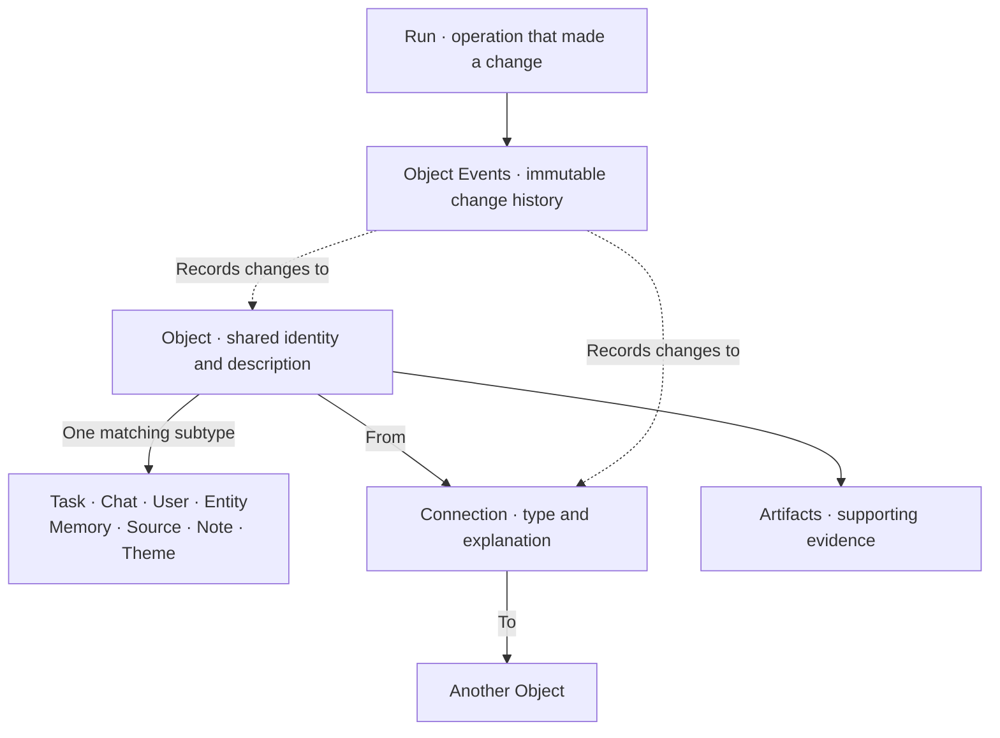

# Centaur Context

> [!IMPORTANT]
> **Centaur Context is an app/extension for [Centaur](https://github.com/paradigmxyz/centaur).** Centaur is an open-source control plane for running and owning your own agent infrastructure. We've created a [Centaur walkthrough video](https://youtu.be/993XrWfg34U).
>
> Install Centaur and become comfortable operating it before adding Centaur Context. If you haven't installed Centaur yet, start with [Centaur's official quickstart](https://centaur.run/quickstart). Then return here and follow the [Centaur Context setup instructions](docs/setup.md).

## How it works

Centaur runs your agents. Centaur Context accumulates shared knowledge they can
reuse. It is a separate Rust service with its own PostgreSQL database, separate
from Centaur's operational database.

Context turns completed interactions into structured records, connects them to
what is already known, and finds relevant information for future work. A web UI
lets you inspect and manage that knowledge.

Two parts make the loop work:

- **Context Builder (read)** searches words, optionally searches by meaning, and
  follows a few related records. It builds a short context packet before the
  agent answers. This is retrieval code; it does not call an LLM.
- **Curator (write)** reviews completed interactions in a separate Run. A model
  proposes what to keep; Context checks the proposal before writing useful
  knowledge and relationships to its database.

Useful knowledge from one interaction can then help the next.

In today's proof of concept, Centaur's Slackbot makes these automatic calls:

1. Before an agent answers, Centaur sends Context the Slack thread identity and
   new question. Context searches, includes nearby records, and returns a short,
   bounded reference packet. Centaur adds it to the agent's input. If Context
   is unavailable, the agent can still answer normally.
2. After the reply, Centaur sends the completed interaction. Context checks the
   token and allowed Slack workspace/channel, then stores the Chat, new messages,
   and interaction Run.
3. When the thread finishes or becomes inactive, Context queues a separate
   Curator Run for messages not already curated. The worker loads those messages
   and potentially related Objects. A model returns a structured plan to change
   Objects or Connections, or to change nothing. Context validates the plan and
   records approved changes with evidence. Not every conversation creates a
   Memory.

### Optional agent tools

Agents can use Context tools when they need more than the automatic packet. The
small [Python clients](tools/centaur_context) in this repo call Context's Rust
HTTP API; they do not read or change PostgreSQL themselves. An authorized agent
can use them to:

- get relevant context;
- search Objects and read one Object;
- create a Note;
- create or update a Task.

These tools are optional. When loaded through Centaur's overlay and credential
proxy, the proxy holds the real, purpose-bound API tokens; the agent sandbox
does not receive them.

## The schema and ontology

I tried both graph queries in Neo4j and a simple wiki with search tools. The
lesson was that capturing useful information, finding it at the right time, and
checking the results matter more than choosing a "perfect" database. Evals tell
us whether that loop actually helps.

Context takes a middle path: PostgreSQL stores knowledge in a graph-shaped
structure. Each first-class thing is an **Object** with a stable ID, type,
title, and description. Each type adds its own fields. The current types are
Tasks, Chats, Users, Entities, Memories, Sources, Notes, and Themes.

**Connections** link Objects and explain *why* they are related. A Memory might
be `derived_from` a Chat, or a Task might `depend_on` another Object. The types
and relationships form the **ontology**: a shared map of what the system knows.

Specific descriptions matter: titles alone can be ambiguous, while clear
descriptions help text and meaning-based search find the right Object. For more
detail, see [Architecture](docs/architecture.md). If deep graph traversal later
becomes important, a graph database can be reconsidered.

## Connecting it to your Centaur

Context is a working candidate for Centaur's proposed App model, but today it
is installed beside Centaur, not as a built-in App. The Slack proof of concept
uses changes in [my Centaur fork](https://github.com/bradwmorris/centaur),
**not** Paradigm's original repository: two Context hooks, supporting Chat/Run
identity changes, and a separate optional Curator inference route. Stock
Centaur does not include this integration.

To evaluate it, read the [integration guide](docs/centaur-integration.md) and
[fork audit](https://github.com/bradwmorris/centaur/blob/main/docs/fork-audit-2026-09-15.md).
You do not need to install anything just to review the design. If you want to
try it, make Centaur changes in **your own fork** and follow the
[setup guide](docs/setup.md) for your deployment's requirements and limitations.

## Documentation

- [Architecture](docs/architecture.md) — the system, schema, and context loop.
- [Setup and operations](docs/setup.md) — install, connect, verify, and maintain
  Centaur Context beside an existing Centaur deployment.
- [Centaur integration contract](docs/centaur-integration.md) — the small
  connection between the proposed App and Centaur core.
- [UI modules](docs/ui-modules.md) — trusted compile-time views over canonical
  Context data.
- [Integration API](docs/api.md) — supported endpoints, credentials, headers,
  and minimal request examples.

Centaur Context runs alongside Centaur with its own PostgreSQL database. Centaur
owns agent execution; Context owns shared knowledge. Company-specific prompts,
workflows, and integrations belong in a private overlay.

Version 0.3.0 supports one organization on a local machine or trusted private
network. See [compatibility.toml](compatibility.toml) for the supported contract.

## Development

See [Contributing](CONTRIBUTING.md) for repository boundaries, development
checks, and contribution guidance. Agent-assisted contributors should also read
[AGENTS.md](AGENTS.md).

## License

[MIT](LICENSE). [Centaur](https://github.com/paradigmxyz/centaur) is separate
software with its own license.
