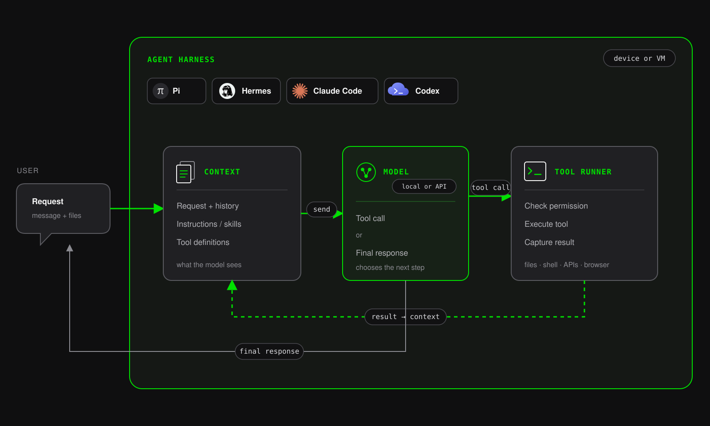

# Architecture

Centaur Context is an optional shared-context application that runs alongside
Centaur. This progressive architecture series starts with the agent harness
and Centaur runtime that Context extends. Later diagrams add Centaur Context,
private overlays, ordinary agent turns, and source-ingestion workflows.

## 0. Agent harness anatomy

The model is not the harness. A harness such as Codex, Claude Code, or Hermes
assembles context, calls the model, executes permitted tool requests, adds their
results to context, and repeats until the model returns a final response.
Skills are optional instructions loaded into context. The harness process can
run on your device or a VM; the model can be local or reached through an API.

## 1. Centaur core

Centaur core keeps the control plane, operational state, agent sandbox, and
approved capabilities in your infrastructure. Each temporary sandbox runs one
selected harness—Claude Code, Codex, Hermes, or Pi—while PostgreSQL preserves
the session and event record outside that sandbox.

Centaur Context is a separate application beside this runtime. It owns shared
Objects, Connections, Sources, Notes, search, and its human-facing UI; Centaur
continues to own agents, Slack delivery, sandboxes, and model execution.
