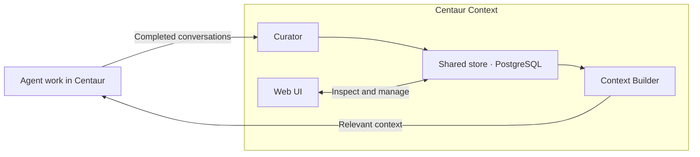
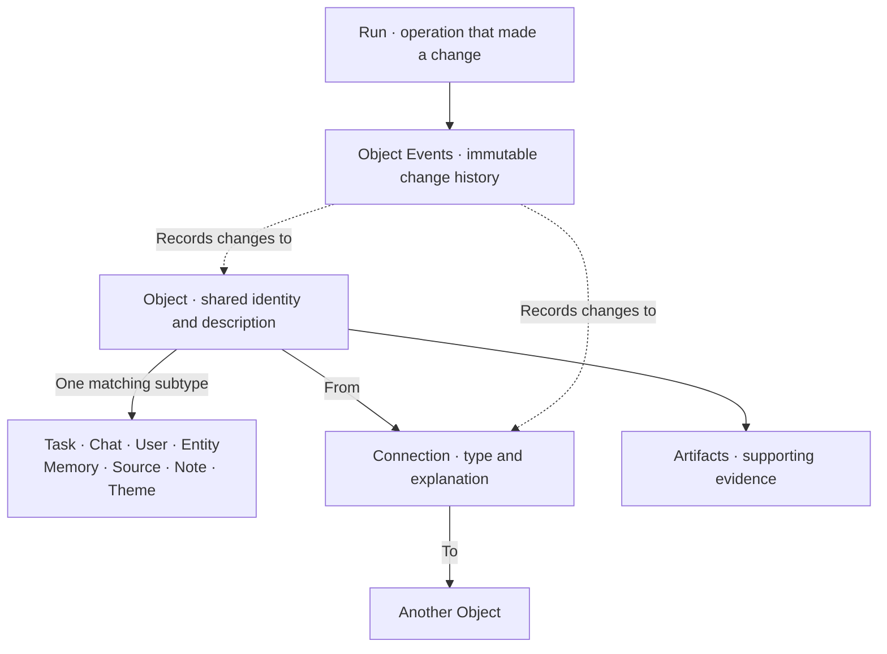

# Architecture

Centaur Context is a self-hosted shared context layer beside Centaur. Knowledge
persists beyond an individual conversation, sandbox, or agent harness.

## 1. The system

| Part | Role |
| --- | --- |
| Curator | Turns completed conversations into useful records and relationships. |
| Shared store | Keeps those records, supporting evidence, and change history. |
| Context Builder | Selects relevant information for the current question. |
| Web UI | Lets people inspect, edit, connect, and review the shared knowledge. |

Centaur owns agents, Slack delivery, sandboxes, and model execution. Context
owns shared knowledge and its API. A private overlay supplies organization-specific
prompts, workflows, and policies.

Agents access Context through an authenticated HTTP API, never database
credentials. General retrieval uses a read credential; curation and other
explicitly authorized writes use their appropriate authenticated contracts.

## Context as a proposed Centaur App

Centaur's proposed App model is intended for independently released services
that Centaur can deploy beside its control plane. That system is not implemented
in production today, so Context is currently installed manually as a companion
service.

Context already has the shape of an App: one independently versioned container,
a web UI, an API, persistent application state, background workers, health
checks, and an agent tool. The intended ownership is:

| Part | Home |
| --- | --- |
| Objects, Connections, database, search, Curator, API, and UI | Context App |
| App deployment, routing, identity, secrets, upgrades, and removal | Centaur App platform |
| Completed-interaction and pre-execution context hooks | Centaur core |
| Organization-specific agents, prompts, policies, and workflows | Organization overlay |

Context currently exposes several internal listeners with different credentials
and callers rather than the draft App model's single-port example. It also owns
database migrations and background work. These are useful real-world questions
for the unfinished App contract; they are not reasons to move Context's ontology
or database into Centaur core.

See the [Centaur integration contract](centaur-integration.md) for the two small
runtime exchanges needed by the complete context loop.

## 2. The schema is the ontology

An **ontology** defines what kinds of things a system can represent and how they
relate. In Centaur Context, that structure is implemented directly in the database
schema and enforced by the application. It is the shared model humans and agents
read and update.

Every first-class thing has one canonical **Object**: its ID, type, title,
description, revision, and provenance. A matching subtype record holds fields
specific to that type. **Connections** link Objects and explain the relationship.

This is a simplified schema view. Subtypes share their Object's ID; Artifacts,
Connections, Runs, and Object Events support Objects rather than being Object types.

| Object type | Represents |
| --- | --- |
| Task | Confirmed work and its status. |
| Chat | A conversation thread. |
| User | A human or agent. |
| Entity | A subject such as an organization, project, product, or concept. |
| Memory | An event or durable insight from what happened. |
| Source | A work used as evidence, such as an article, paper, or video. |
| Note | Human- or agent-authored text. |
| Theme | A human-approved category for organizing Objects. |

Connections use six relationships: `involves`, `about`, `related_to`,
`depends_on`, `derived_from`, and `themed`. Every Connection includes an explanation.
For example, a Task **involves** a User and is **derived_from** the Chat where the
work was agreed.

A Source identifies a work; its Artifacts preserve captured text, transcripts,
files, or references. Chat messages preserve the conversation. Runs record
operations, and immutable Object Events record Object and Connection changes.
Undo adds a compensating change instead of rewriting history. Embeddings are
derived search data, not canonical knowledge.

The live schema is available at `/api/v2/schema` on the trusted human listener;
[migrations](../migrations) hold its versioned definition.

## 3. The context loop

1. **Capture:** Centaur sends Slack thread updates; Context stores the Chat,
   messages, and participants.
2. **Curate:** An explicit finish or 10 minutes of inactivity closes the interaction.
   The Curator updates useful Objects and Connections. It creates Memories only
   when there is something durable to retain, and Tasks only for explicit work
   or commitments.
3. **Retrieve:** Before a later reply, Context Builder combines word search,
   optional meaning search, and the current Chat's participants and Connections.
4. **Use:** The agent receives up to 10 Objects within a 12,000-character packet.
   It can search and read more Objects, Notes, or Source material when needed.

The ordinary Slack reply agent reads context; the separate Curator writes inferred
context after the interaction ends. Other authorized workflows can contribute
through scoped write APIs, such as Note creation.

Word search works without an embedding provider. Optional meaning search covers
Object summaries and eligible newly captured Artifact chunks; historical
Artifacts remain available through word search.

This is the compounding loop: useful knowledge from one interaction becomes
available to the next, while people can inspect and correct the shared record.
