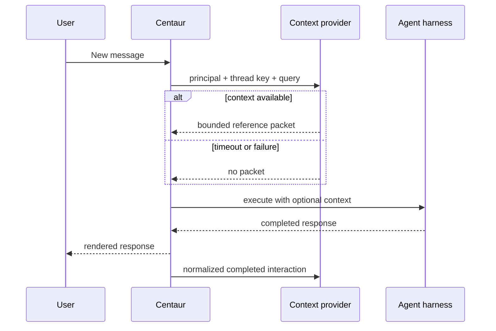

# Centaur integration contract

This document describes the small connection between the proposed Context App
and Centaur core. The Context database, UI, Curator, and retrieval system remain
in the App; Centaur only needs generic points for exchanging completed
interactions and relevant pre-execution context.

See [Architecture](architecture.md) for the broader packaging, trust, and
proposed App lifecycle model.

This repository does not install Centaur. Install and verify Centaur using its
official [Quickstart](https://centaur.run/quickstart), then return here only to
evaluate or connect Centaur Context.

## How to evaluate this project

There are two distinct reviews:

1. **Design review, with no installation:** read this contract and
   [Architecture](architecture.md). This is enough to inspect the proposed App
   boundary, data ownership, security model, and required Centaur hooks. Do not
   create a Context database merely to review the proposal.
2. **Working integration review:** first confirm that
   [`compatibility.toml`](../compatibility.toml) names a current tested Centaur
   revision. Use Centaur's own documentation to operate Centaur, and use
   [Setup and operations](setup.md) only for the separate Context database,
   service, credentials, tool, and verification steps.

Centaur Context is not presented as a standalone product. The UI and API are
parts of the Context service, but the useful capture-and-retrieval loop depends
on the Centaur integration described below.

## Current compatibility

The full Slack loop has been tested against the maintainer's Centaur fork, not
an untouched current upstream Centaur checkout. The fork originally introduced
the integration in these commits:

| Commit | Contract introduced |
| --- | --- |
| `225a6104` | Optional post-response `interactionSink` |
| `d8a7dfc2` | Portable fetch typing for the integration |
| `33e7cd59` | Optional pre-execution `contextBuilder` |

Later fork commits add trace, identity, usage, multi-instance, and explainable
evaluation behavior. As of 2026-09-09, upstream `paradigmxyz/centaur` does not
contain the two lifecycle hooks. The fork also trails current upstream, so these
historical commits are evidence of the contract, not a safe installation recipe.

## The minimum Centaur surface

Context needs two optional, provider-neutral lifecycle boundaries.

### 1. Completed-interaction sink

After Centaur has durably completed and rendered an interaction, it sends a
normalized snapshot containing:

- stable provider, workspace, channel, thread, interaction, execution, and turn
  identities;
- ordered human and agent messages with timestamps;
- participant identities needed to maintain canonical Users;
- completion state and, when available, normalized usage/trace metadata.

Delivery should be idempotent, bounded by a short timeout, and best-effort with
observable failure. A Context outage must not retract or block a user-visible
Centaur response. The receiver owns surface allowlisting, deduplication, and
domain-specific curation.

### 2. Pre-execution context provider

Immediately before a new execution, Centaur requests context with:

- the authenticated principal;
- the stable provider thread key;
- the current user query; and
- a caller-selected result limit within the provider's hard bounds.

The provider returns an optional plain-text reference packet plus count and
truncation metadata. Retrieval is fail-open: timeout, rejection, or malformed
data is logged and the agent turn continues without external context. Centaur
must label the packet as untrusted reference data and keep it distinct from
reconstructed conversation history.



## Security boundary

Centaur's trusted transport or proxy holds the Context bearer tokens. The agent
sandbox receives neither the tokens nor a database credential. Retrieval and
ingestion use separate purpose-bound credentials. Context independently checks
the exact allowed Slack surface and canonical thread identity.

The integration must not grant Context access to Centaur's operational database,
make Context a prerequisite for agent execution, or embed an organization-specific
ontology in Centaur.

## Curator model transport is a separate decision

The two hooks above capture and retrieve context. Automatic curation separately
needs a model endpoint. The currently tested default, `centaur_subscription`,
calls a purpose-bound private inference route added later in the maintainer's
Centaur fork. That inference route is not part of upstream Centaur.

Context also implements `direct_api`, a metered provider-key transport currently
classified as an explicit rollback path. Before a general extension release,
the project should either make a provider-neutral model contract the supported
adopter path or propose the narrow inference boundary separately. This choice
does not require Centaur to adopt Context's ontology or database.

## What could belong upstream

The smallest upstream contribution would be generic configuration and types for
the two hooks, with adapter-owned HTTP implementations and tests for:

- disabled-by-default behavior;
- paired URL/token validation;
- timeout and malformed-response degradation;
- secret isolation from sandboxes;
- stable identity and idempotent retry semantics;
- separation of shared context from conversation reconstruction; and
- no regression to response rendering when either service is unavailable.

Centaur Context's ontology, database, UI, Curator, retrieval ranking, and
organization-specific workflows remain outside Centaur. That boundary allows
other context providers or audit sinks to implement the same hooks.

An alternative is to keep every change in an extension-maintained Centaur fork.
That avoids an upstream API commitment, but it leaves adopters responsible for
continually rebasing security- and lifecycle-sensitive Slack changes. For an
official extension, a small stable hook contract is the more maintainable shape.

## Current deployment configuration

The reviewed fork exposes the hooks through Helm values similar to:

```yaml
slackbotv2:
  interactionSink:
    url: http://centaur-context:8082/api/v2/ingest/slack/interactions
    timeoutMs: 5000
    secretName: centaur-context-env
    secretKey: CHAT_INGEST_API_TOKEN

  contextBuilder:
    url: http://centaur-context:8081/api/v2/context
    timeoutMs: 1500
    limit: 10
    secretName: centaur-context-env
    secretKey: AGENT_API_TOKEN
```

The exact values and network policy are documented in
[Setup and operations](setup.md). A production operator should pin a reviewed
Centaur fork commit and Context image digest together in an installation record.

## Adoption gates

Before claiming compatibility with stock Centaur or publishing a stable release:

1. agree an upstream hook contract or publish a maintained, current fork;
2. reconcile and test the fork against current upstream Centaur;
3. define and test the supported Curator model transport for general adopters;
4. publish an exact compatibility matrix and immutable release artifacts;
5. exercise capture, curation, retrieval, and degraded operation end to end; and
6. prove that removal of Context leaves ordinary Centaur execution intact.
