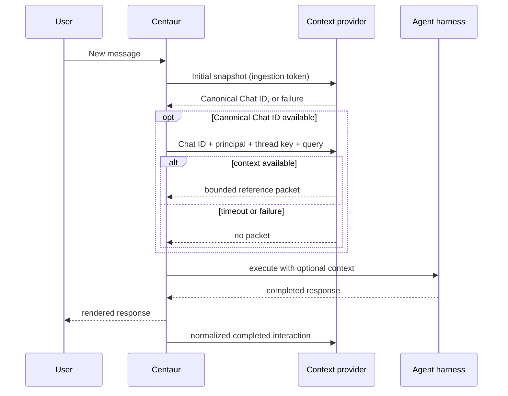

# Centaur integration contract

This document describes the small connection between the proposed Context App
and Centaur core. The Context database, UI, Curator, and retrieval system remain
in the App; Centaur only needs generic points for exchanging completed
interactions and relevant pre-execution context.

See [Schema and ontology](schema.md) for the shared knowledge model. This
contract covers the App boundary and required Centaur hooks.

This repository does not install Centaur. Install and verify Centaur using its
official [Quickstart](https://centaur.run/quickstart), then return here only to
evaluate or connect Centaur Context.

## How to evaluate this project

There are two distinct reviews:

1. **Design review, with no installation:** read this contract and
   [Schema and ontology](schema.md). This is enough to inspect the proposed App
   boundary, data ownership, security boundary, and required Centaur hooks. Do not
   create a Context database merely to review the proposal.
2. **Working integration review:** compare your Centaur revision with the
   required hooks below. [`compatibility.toml`](../compatibility.toml) records
   the contract, not a certified release pair. Use Centaur's own documentation
   to operate Centaur, and use
   [Setup and operations](setup.md) only for the separate Context database,
   service, credentials, tool, and verification steps.

Centaur Context is not presented as a standalone product. The UI and API are
parts of the Context service, but the useful capture-and-retrieval loop depends
on the Centaur integration described below.

## Current compatibility

Historical Slack-loop testing used the maintainer's Centaur fork. This repository
does not yet record a freshly end-to-end tested Context/Centaur pair in
`compatibility.toml`. The fork originally introduced the integration in these
commits:

| Commit | Contract introduced |
| --- | --- |
| `225a6104` | Optional post-response `interactionSink` |
| `d8a7dfc2` | Portable fetch typing for the integration |
| `33e7cd59` | Optional pre-execution `contextBuilder` |

Later fork commits add trace, identity, usage, multi-instance, and explainable
evaluation behavior. These historical commits are evidence of the contract, not
a safe installation recipe or a claim about the current fork/upstream distance.

## Adapting the Slack integration

Start with your running Centaur revision and the deployment plan in
[setup](setup.md#0-plan-for-your-existing-deployment). Installing Context or
loading its tools does not add Slack lifecycle hooks to Centaur. If your fork
lacks the following behavior, it needs a separately reviewed integration change
before the setup values can work.

1. **Capture and identify the Chat.** Before retrieval, send the current Slack
   snapshot to `POST /api/v2/ingest/slack/interactions` using the ingestion token,
   with `interaction_finished: false` and a running interaction. Keep workspace,
   channel, root-thread timestamp, message IDs, and human/agent identities stable.
   Use the returned `chat_object_id`; never substitute a retrieved Object ID.
   Preserve the current triggering message timestamp separately from the thread
   root. The [API reference](api.md) defines the payload and allowed thread forms.
2. **Retrieve before execution.** Send the question, canonical Chat ID, principal,
   and matching thread key to `GET /api/v2/context` with the agent token. Render
   the bounded packet as untrusted reference data, separate from conversation
   history. If no valid Chat ID is available or retrieval fails, record the
   failure and let the ordinary agent turn continue without the packet.
3. **Capture the result.** After response rendering, send the updated snapshot
   with stable message/interaction identities and the actual Run outcome. Include
   available usage and trace evidence; label unavailable values rather than
   inventing them. The finish signal or Context's inactivity handling makes
   eligible windows available for Memory extraction. Snapshot failures must not
   retract the delivered response; retries must preserve identities and content.
4. **Wire configuration and private transport.** Adapt the hook URLs, timeouts,
   Secret references, and approved Slack surfaces to your installation. Review
   caller egress, receiver ingress, DNS, and service ports using the
   [setup network checklist](setup.md#hook-configuration). Neither hook needs
   access to Centaur's database. First exercise success and outage behavior in a
   disposable environment and record the exact revisions and configuration.

The following public files were source-reviewed at fork revision
`f44ce662f3b3fca63bd4c162add332cb43ec035c`. This is a source reference, **not a
tested installation pin**. Compare behavior and dependencies in your chosen
revision instead of copying these files wholesale.

| Integration part | Public source |
| --- | --- |
| Snapshot payloads, participant profiles, response Chat identity | [interaction-sink.ts](https://github.com/bradwmorris/centaur/blob/f44ce662f3b3fca63bd4c162add332cb43ec035c/services/slackbotv2/src/interaction-sink.ts) |
| Authenticated retrieval and bounded reference formatting | [shared-context.ts](https://github.com/bradwmorris/centaur/blob/f44ce662f3b3fca63bd4c162add332cb43ec035c/services/slackbotv2/src/shared-context.ts) |
| Initial Chat resolution, execution ordering, completion capture, failure handling | [Slackbot lifecycle](https://github.com/bradwmorris/centaur/blob/f44ce662f3b3fca63bd4c162add332cb43ec035c/services/slackbotv2/src/index.ts) |
| Hook settings and Secret-to-environment wiring | [Helm values](https://github.com/bradwmorris/centaur/blob/f44ce662f3b3fca63bd4c162add332cb43ec035c/contrib/chart/values.yaml), [Slackbot template](https://github.com/bradwmorris/centaur/blob/f44ce662f3b3fca63bd4c162add332cb43ec035c/contrib/chart/templates/slackbotv2.yaml) |

Optional additions remain separate: [agent tools](setup.md#optional-agent-tools)
provide explicit search/read/apply; [Curator transport](#curator-model-transport-is-a-separate-decision)
enables automatic Memory extraction; [Memory maintenance](memory.md) has its own
controls. Multiple Slack apps, organization-specific workflows, and unrelated
fork fixes are not prerequisites for a single-app capture/retrieval integration.

## The minimum Centaur surface

Context needs two optional, provider-neutral lifecycle boundaries.

### 1. Completed-interaction sink

After Centaur has durably completed and rendered an interaction, it sends a
normalized snapshot containing:

- stable provider, workspace, channel, thread, interaction, execution, and turn
  identities;
- ordered human and agent messages with timestamps;
- participant identities needed to maintain canonical Users;
- completion state and, when available, normalized usage/trace metadata.

Delivery should be idempotent, bounded by a short timeout, and best-effort with
observable failure. A Context outage must not retract or block a user-visible
Centaur response. The receiver owns surface allowlisting, deduplication, and
domain-specific curation.

### 2. Pre-execution context provider

Immediately before a new execution, Centaur requests context with:

- the authenticated principal;
- the stable provider thread key;
- the current user query; and
- a caller-selected result limit within the provider's hard bounds.

The provider returns query-relevant Objects and a separate general-orientation
section containing up to ten of the database's most-connected active Objects.
Centaur renders both sections under explicit headings in one optional
plain-text reference packet. Query-relevant context has priority within the
shared size bound. Retrieval is fail-open: timeout, rejection, or malformed
data is logged and the agent turn continues without external context. Centaur
must label the packet as untrusted reference data and keep it distinct from
reconstructed conversation history.


```mermaid
sequenceDiagram
    participant U as User
    participant C as Centaur
    participant X as Context provider
    participant A as Agent harness
    U->>C: New message
    C->>X: Initial snapshot (ingestion token)
    X-->>C: Canonical Chat ID, or failure
    opt Canonical Chat ID available
        C->>X: Chat ID + principal + thread key + query
        alt context available
            X-->>C: bounded reference packet
        else timeout or failure
            X-->>C: no packet
        end
    end
    C->>A: execute with optional context
    A-->>C: completed response
    C-->>U: rendered response
    C->>X: normalized completed interaction
```

The diagram includes the Slack implementation's initial Chat handshake. Both
capture calls and retrieval use bounded requests; unavailable Context must leave
ordinary Centaur execution usable. Memory extraction and maintenance are separate
Context operations, not additional steps required to return the answer.

## Security boundary

Centaur's trusted transport or proxy holds the Context bearer tokens. The agent
sandbox receives neither the tokens nor a database credential. Retrieval and
ingestion use separate purpose-bound credentials. Context independently checks
the exact allowed Slack surface and canonical thread identity.

The integration must not grant Context access to Centaur's operational database,
make Context a prerequisite for agent execution, or embed an organization-specific
ontology in Centaur.

## Curator model transport is a separate decision

The two hooks above capture and retrieve context. Automatic curation separately
needs a model endpoint. The default transport, `centaur_subscription`,
calls a purpose-bound private inference route added later in the maintainer's
Centaur fork. That inference route is not part of upstream Centaur.
Use the [model configuration guidance](setup.md#3-create-the-kubernetes-secret)
to match the exact model and broker. The example is source-reviewed, not a
certified pair; verify the model connection when enabling it in your deployment.

Context also implements `direct_api`, a metered provider-key transport currently
classified as an explicit rollback path. Before a general extension release,
the project should either make a provider-neutral model contract the supported
adopter path or propose the narrow inference boundary separately. This choice
does not require Centaur to adopt Context's ontology or database.

## What could belong upstream

The smallest upstream contribution would be generic configuration and types for
the two hooks, with adapter-owned HTTP implementations and tests for:

- disabled-by-default behavior;
- paired URL/token validation;
- timeout and malformed-response degradation;
- secret isolation from sandboxes;
- stable identity and idempotent retry semantics;
- separation of shared context from conversation reconstruction; and
- no regression to response rendering when either service is unavailable.

Centaur Context's ontology, database, UI, Curator, retrieval ranking, and
organization-specific workflows remain outside Centaur. That boundary allows
other context providers or audit sinks to implement the same hooks.

An alternative is to keep every change in an extension-maintained Centaur fork.
That avoids an upstream API commitment, but it leaves adopters responsible for
continually rebasing security- and lifecycle-sensitive Slack changes. For an
official extension, a small stable hook contract is the more maintainable shape.

## Current deployment configuration

The reviewed fork exposes the hooks through Helm values similar to:

```yaml
slackbotv2:
  interactionSink:
    url: http://centaur-context:8082/api/v2/ingest/slack/interactions
    timeoutMs: 5000
    secretName: centaur-context-env
    secretKey: CHAT_INGEST_API_TOKEN

  contextBuilder:
    url: http://centaur-context:8081/api/v2/context
    timeoutMs: 1500
    limit: 10
    secretName: centaur-context-env
    secretKey: AGENT_API_TOKEN
```

The exact values and network policy are documented in
[Setup and operations](setup.md). A production operator should pin a reviewed
Centaur fork commit and Context image digest together in an installation record.

## Future stable-release requirements

Before claiming compatibility with stock Centaur or publishing a stable release:

1. agree an upstream hook contract or publish a maintained, current fork;
2. reconcile and test the fork against current upstream Centaur;
3. define and test the supported Curator model transport for general adopters;
4. publish an exact compatibility matrix and immutable release artifacts;
5. exercise capture, curation, retrieval, and degraded operation end to end; and
6. prove that removal of Context leaves ordinary Centaur execution intact.
