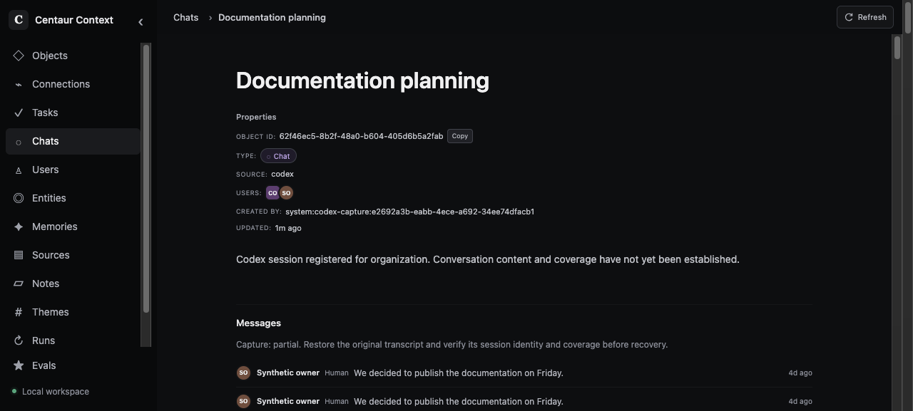
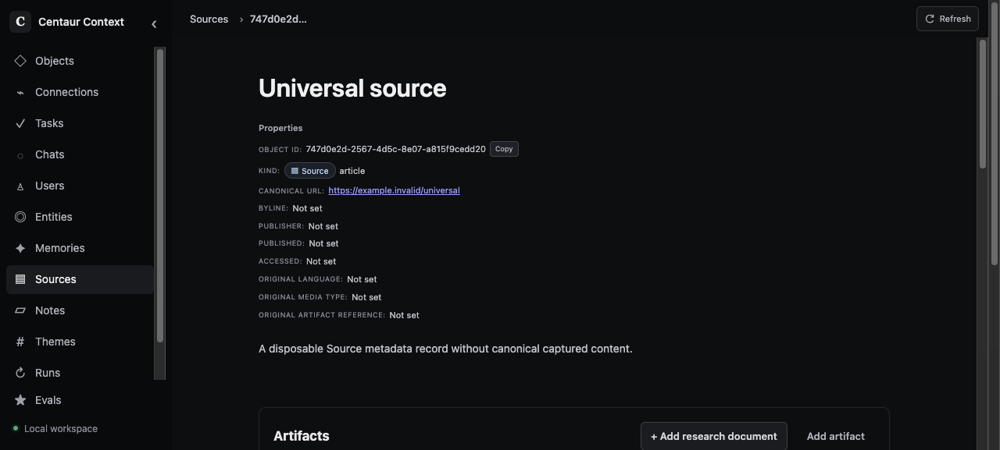

# Data quality verification

All examples and screenshots use a guarded disposable PostgreSQL database with
synthetic records. No production content is included.

- Filtered lexical and hybrid search retain an exact User with 150 competing
  other-kind Memories, including multi-kind filters. Existing body-only exclusion
  and current-vector tests remain intact.
- Explicit Note windows preserve long Unicode text, intent and continuation.
- Codex contracts cover immutable routing, replay, technical Git receipts and a
  bounded curator summary with an unchanged-input no-call check.
- Task milestone tests verify the actual Task link, replay and distinct events.
- Maintenance tests cover legacy verified receipts, locks/revisions/undo,
  incomplete-evidence deferral and retry cap, policy-version reconsideration,
  and preview rollback without another model call.
- Authenticated audit pagination includes archived Objects and enforces bounds;
  invalid credentials fail. It reuses the existing inventory query.

Browser verification used the actual local application and synthetic fixture
records. The Chat displays partial coverage and the recovery action, and its
participant links correctly identify Codex. Source artifacts show the Research
document action; canonical research Objects remain under Notes. Browser errors
were empty.

Production adoption must deploy the server before the updated bridge/client.
No data repair is part of this PR. Historical gaps remain unresolved until their
original evidence and identity can be verified. Large summary windows produce an
explicit deferred trace; maintenance input exceeding its evidence budget is also
deferred rather than marked reviewed. Model wording remains evidence constrained
by prompts and requires deployment-owner live acceptance; synthetic transport
fixtures are not a claim of production semantic quality.
