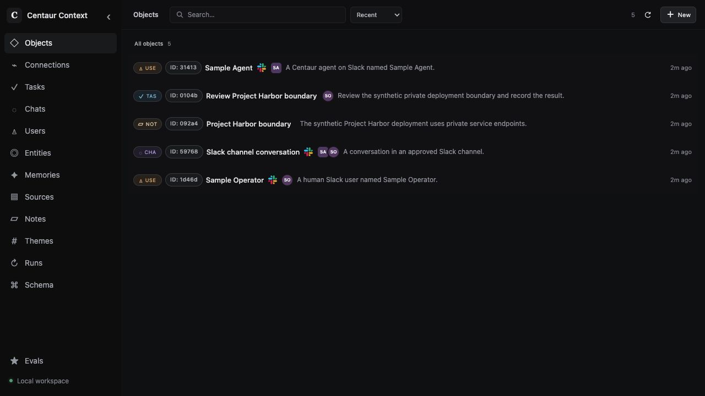

# Issue 131: Step 5 component evidence

Status: **partial; full fresh-install acceptance blocked**. Recorded 2026-10-02.
This receipt does not establish a tested Centaur/Context release pair or authorize
Step 6. Synthetic caller pods exercised the real Context application and database;
Centaur, Slackbot, iron-proxy, and a model were not running in this fixture.

## Versions and scope

- Context deployment examples and installer: branch commit
  `a093ff64db4f7257fbb725a97916f12261ea3d1b`.
- Centaur chart source rendered at
  `f44ce662f3b3fca63bd4c162add332cb43ec035c`, chart `0.1.141`, using
  `deploy/centaur-values.example.yaml`. Only its NetworkPolicies were applied.
  Rendered application services were ClusterIP; no Ingress or HTTPRoute appeared.
- Cached Context image tag:
  `centaur-context:dev-b822d841294c814f1e04bb4358f6bde53a08d402`.
  Docker image ID:
  `sha256:b4468d42c909211828e705592ca57e2810b5352458b463238b1373b66c9bd11e`.
  Running container image ID:
  `sha256:b7df3a38dadad7ba17c85bef832ce3d6ed661e8cc4d0eace19efb372e2fe2dcd`.
  This was not freshly built. Its tag is not verified source provenance, even
  though runtime source files have not changed from the named base revision.
- PostgreSQL `16.15`, pgvector `0.8.6`; cached `pgvector/pgvector:pg16` running
  container image ID:
  `sha256:2dbfde49c067cafff2a69e7019423181adca6328b94f197ac93fbb01a96a3a9d`.
- kind `v0.32.0`, Kubernetes `v1.36.1`, arm64, Linux `6.12.5-linuxkit`.
  Node image digest:
  `sha256:3489c7674813ba5d8b1a9977baea8a6e553784dab7b84759d1014dbd78f7ebd5`.
- Calico `v3.32.2`, installed from its official tagged manifest with pod CIDR
  `10.245.0.0/16`. Node image digest:
  `sha256:99b03fe91e8bfbcb153ae65ef4b701b24ce541ffdd74ff314eb041096008f7fd`;
  controller image digest:
  `sha256:7870b67ebb13fabc3005252b44fe6e78b21635649bd3072b80afa1684b6565d0`.
  The [Calico requirements](https://docs.tigera.io/calico/latest/getting-started/kubernetes/requirements)
  list Kubernetes 1.36 and arm64 support. The
  [kind installation guide](https://docs.tigera.io/calico/latest/getting-started/kubernetes/kind)
  supplies the default-CNI-disabled setup.

## Disposable installation

The cluster `centaur-context-131-runtime` used a dedicated kubeconfig, explicit
context on every kubectl operation, loopback API binding, disabled default kind
CNI, and service CIDR `10.97.0.0/16`. Calico and CoreDNS became healthy before
application checks. No host resource allocation or shared workload was changed.

The fixture created namespaces `centaur` and `other-131`, generated new random
bearer tokens and database passwords, and initialized the repository's database
bootstrap script against `centaur_context_test_131`. PostgreSQL used an emptyDir
and a separate application role. Credentials stayed in local mode-0600 fixture
files and Kubernetes Secrets; probes received HTTP bearer values over stdin.
No sandbox received a database DSN. No live credentials or real Slack messages
were used.

The Centaur chart's NetworkPolicies and all three opt-in policies in
`deploy/context-peers.example.yaml` were applied to this new namespace. The actual
Context installer ran with explicit namespace/context and `--apply --image` for
the cached image above. Database initialization and Context readiness succeeded.
The image import initially failed on a missing other-platform digest; explicit
`linux/arm64` containerd imports resolved it. A subsequent disposable deployment
restart was healthy. An initial short Calico rollout wait also expired during
startup; the completed rollout was healthy before testing.

## Observed component results

| Check | Observation |
| --- | --- |
| Cluster DNS | Context Service resolved from all four probe pods. |
| Allowed network paths | Slackbot-labeled pod reached 8081 and 8082; proxy-labeled pod reached 8081. Missing bearer returned HTTP 401. |
| Authenticated API | Proxy-labeled pod received HTTP 200 from readiness using a generated token and the real database. |
| Forbidden paths | Nine requests timed out after four seconds: Slackbot label to Pod IP ports 8080/8083/8084; unrelated same-namespace pod to 8080/8081/8082/8083; matching Slackbot labels in another namespace to 8081/8082. |
| Synthetic capture | Ingestion returned 202; replay returned the same canonical Chat ID. A synthetic completion was subsequently accepted. |
| Explicit Fact | Universal apply created a Note with intent `fact`; exact replay returned `replayed: true`. |
| Explicit Task | Universal apply accepted a Task assigned to the captured human User, a due date, a brief, and an explained `related_to` Connection to the Note in one request. |
| Later retrieval | Read returned both explicit Objects; search returned both; the canonical Chat context request returned Objects. |
| Human UI | Loopback port-forward showed five synthetic Objects: two Users, Chat, Note, and Task. No browser console errors were captured. |

Requests were raw HTTP over TCP from credential-free probe containers, using a
four-second process timeout. Denied checks targeted the Pod IP so absence of a
Service port could not explain the result. The positive requests provide a
reachability control. This is bounded isolation evidence, not a complete policy
matrix, adversarial security test, or proof of actual iron-proxy secret injection.
Read requested Connections and Events; this receipt does not claim a separate
assertion of every returned event or Connection field.

The UI's Slack labels describe synthetic API payloads. They do not mean an actual
Slack interaction occurred.

## Remaining acceptance and required inputs

Scoped read-only inspection found no approved reusable disposable Slack/model
test arrangement. Historical receipts are not authorization to reuse credentials.
The host had approximately 7.65 GiB Docker memory, with an existing cluster using
4.5–4.8 GiB. This component cluster used about 1.03 GiB. Free disk was roughly
8–9 GiB. These observations justify the bounded component run; they do not prove
enough capacity for clean builds and the full Centaur workload. Full builds were
not attempted, and no capacity increase or shared-service shutdown was performed.

To complete Step 5, supply an approved disposable Slack surface plus authorization
for the specific test sends, a disposable-use model identity/credential with
approved usage, and sufficient separate or approved spare capacity for immutable
Context and Centaur builds and their complete deployment. Record verifiable image
provenance for both revisions.

Still unverified: the full paired fresh install, actual Slack capture and reply,
real proxy/tool routing and secret injection, Memory extraction with a model,
retrieval through a later real interaction, and ordinary Centaur replies during a
Context outage. No outage test was performed. Optional Codex, embeddings, and
maintenance were not exercised. No tested-version pin was published.

The disposable cluster, port-forward, browser tab, and generated credential files
were removed after collecting evidence. Cleanup is not a Step 6 backup/restore or
removal acceptance test. The primary checkout and ambient kube context remained
unchanged.
